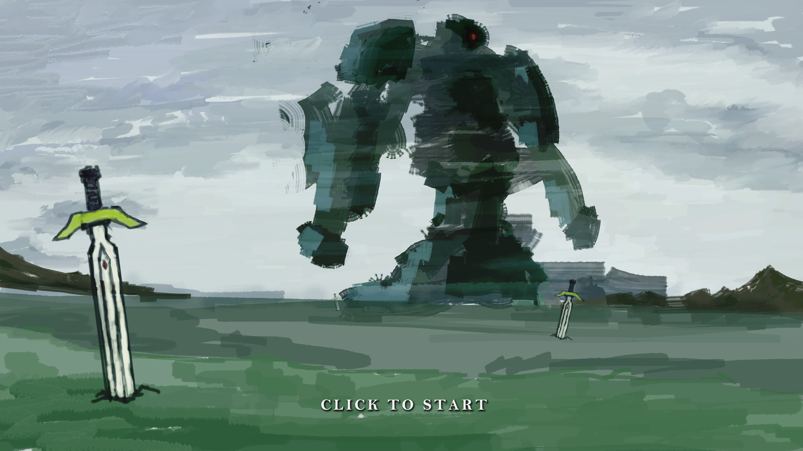

# To The Fairyland

A top-down, RPG Maker–style pixel RPG that runs in the browser. Finalist at the 21st Stony Brook University Game Programming Competition.

**Play it:** https://to-the-fairyland.firebaseapp.com/

## Story

You play as Fate, a "fake knight" who is entrusted with a dying expedition member's mission to reach Fairyland and ask the fairies to help save humanity.

## Tech

TypeScript, [Wolfie2D](https://github.com/WolfieEngine) (a 2D game engine by Prof. Richard McKenna), WebGL, Firebase hosting

## Controls

- **WASD / Arrow keys:** Move
- **J / Z:** Interact / Confirm
- **K / X:** Cancel
- **C:** Open menu / inventory
- **ESC:** Pause

## Development Milestones

- [Benchmark 1: Game Design Document](https://to-the-fairyland.firebaseapp.com/benchmark1)
- [Benchmark 2: Playable Build](https://to-the-fairyland.firebaseapp.com/benchmark2)
- [Benchmark 3: Playable Build](https://to-the-fairyland.firebaseapp.com/benchmark3)
